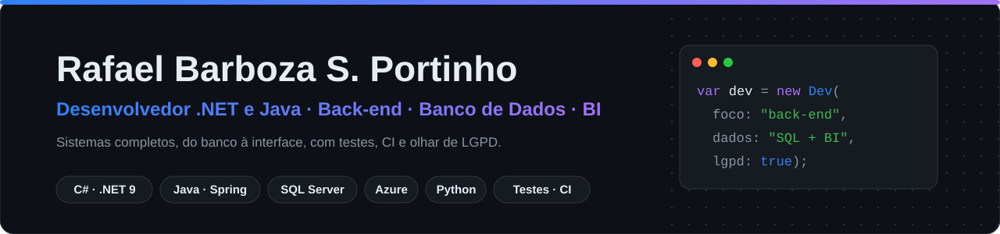

<!-- O GitHub mostra o banner escuro ou o claro conforme o tema de quem visita. -->
<picture>
  <source media="(prefers-color-scheme: dark)" srcset="assets/banner-escuro.svg">
  <source media="(prefers-color-scheme: light)" srcset="assets/banner-claro.svg">
  
</picture>

[Português](#português) · [English](#english)

<!-- CONTATOS: preencher com os links autorizados

-->

---

## Português

### Sobre mim

Sou analista e desenvolvedor de sistemas, com experiência em **liderança técnica no setor público**. Construo aplicações web completas, do banco de dados à interface, com **C#/.NET**, **Java/Spring** e **Python**, e uso dados para apoiar decisões.

Sou especialista em **Banco de Dados** e em **Gestão de TI**. Também tenho formação em Direito com especialização em **Proteção de Dados**, o que me dá um olhar atento para **LGPD, segurança e conformidade** nos sistemas que desenvolvo.

- 🏛️ Hoje sou pesquisador de projetos em tecnologia na **SEGER-ES**, no Programa INOVA
- 🎓 Estou no último período de **Sistemas de Informação**
- 🧭 Organizo cada projeto com **Lean Inception**: visão, personas, jornadas e MVP antes do código

### Tecnologias

**Back-end**
 

**Front-end**
 

**Banco de dados**
 

**Deploy e DevOps**
 

**Qualidade e testes**
 

**Dados e BI**
 

### Projetos em destaque

| Projeto | O que é | Stack |
|---|---|---|
| [**Cofre**](https://github.com/barbozadevti/cofre) | Banco digital que avisa antes do aperto e protege o cliente: Copiloto com previsão de saldo, Escudo de juros (a poupança cobre o negativo), antifraude explicável no Pix, portabilidade de salário e visão executiva para a diretoria; corrente e poupança com herança e polimorfismo, Pix com QR Code no padrão do Banco Central, perfis e auditoria | Java 21 · Spring Boot 4 · Spring Security · JPA · Flyway · PostgreSQL · Docker · CI |
| [**Pulso**](https://github.com/barbozadevti/pulso) | Gestão de redes de academias que avisa quem vai cancelar antes de cancelar: painel executivo com receita em risco, catraca com regras explicadas, aulas com fila de espera e retenção medida; risco de evasão com motivos e laboratório de JPA que mede o N+1 em SQL real. Funciona no celular | Java 21 · Spring Boot 4 · Spring Data JPA · 30 testes · CI |
| [**Três em Um**](https://github.com/barbozadevti/tres-em-um) | O iPhone modelado em UML e funcionando no navegador: interfaces para reprodutor musical, telefone e navegador, `IPhone` por composição, proxy dinâmico que mostra cada método chamado, música sintetizada em Web Audio e diagrama conferido por teste | Java 21 · Spring Boot 4 · Web Audio · JUnit 5 · Docker · CI |
| [**Jornada**](https://github.com/barbozadevti/jornada) | Plataforma de bootcamps: trilhas de cursos, mentorias e desafios com login por papéis (coordenador e aluno), XP, níveis, ranking e certificado verificável; domínio em POO (hierarquia `sealed`, polimorfismo, encapsulamento) com diagrama UML conferido por teste. [Apresentação interativa](https://barbozadevti.github.io/jornada/) para recrutador e CEO | Java 21 · Spring Boot 4 · 95 testes · Docker · CI |
| [**Crivo**](https://github.com/barbozadevti/crivo) | Sistema de recrutamento (ATS): painel com pendências do dia, compatibilidade candidato x vaga, triagem pelo orçamento, fila de suplentes, avaliação da entrevista, proposta com contraproposta, página pública de carreiras e Kanban validado por máquina de estados (Java 21: `sealed`, `record`, `switch` com padrões) | Java 21 · Spring Boot 4 · JPA · Flyway · PostgreSQL · Docker · CI |
| [**Crachá**](https://github.com/barbozadevti/cracha) | Sistema de RH com login por perfil (RH, gestor, colaborador), regras de LGPD, organograma, férias com aprovação, crachá com QR Code e histórico de cada alteração em Azure Table | C# · ASP.NET Core · EF Core · Azure Table/Blob · Bicep · Docker · CI |
| [**Confere**](https://github.com/barbozadevti/confere) | Biblioteca de validações brasileiras (CPF, CNPJ alfanumérico 2026, boleto, PIX...) com API e site; 391 testes e **100% de nota de mutação** | C# · .NET 9 · xUnit · FsCheck · Stryker · Minimal API |
| [**Vida+ Clínica**](https://github.com/barbozadevti/vida-clinica) | Gestão de clínicas: agenda, fila, prontuário SOAP, PDFs, financeiro e estoque, com login e perfis de acesso | Python · FastAPI · PostgreSQL · JWT · Docker |
| [**Estacionamento**](https://github.com/barbozadevti/estacionamento-csharp) | API REST em Clean Architecture com frontend React e empacotamento Docker | C# · ASP.NET Core · EF Core · React · TypeScript · Docker |
| [**Pauta**](https://github.com/barbozadevti/pauta) | Gerenciador de tarefas com quadro Kanban, calendário e painel de produtividade | C# · ASP.NET Core · EF Core · SQLite/SQL Server · Swagger · CI |
| [**Claquete**](https://github.com/barbozadevti/claquete) | Acervo de filmes com painel de estatísticas e laboratório de consultas SQL ao vivo | C# · .NET 9 · Dapper · SQL Server/SQLite · CI |
| [**Sistema de Hospedagem**](https://github.com/barbozadevti/sistema-hospedagem-completo) | Hóspedes, suítes e reservas, com cálculo automático de estadia | C# · ASP.NET Core · JavaScript |
| [**PhoneForge**](https://github.com/barbozadevti/phoneforge-dotnet) | Gerenciador de celulares que demonstra POO: abstração, herança e polimorfismo | C# · .NET 9 · Minimal API · JavaScript |

### Experiência

**Pesquisador de Projetos em Tecnologia**: SEGER-ES (Secretaria de Gestão e Recursos Humanos) · *2024 – atual*
- Monitoramento e avaliação do **Programa INOVA SEGER** (Smart-Gov / Geinov)
- Acompanhamento de indicadores de inovação e eficiência administrativa e avaliação de resultados de políticas públicas

**Supervisor de TI**: SEJUS-ES (Secretaria de Estado da Justiça) · *nov/2023 – dez/2024*
- Liderança da equipe de desenvolvimento de soluções para processos internos
- Supervisão de projetos de infraestrutura e da continuidade dos serviços
- Análise e revisão de contratos de TI, garantindo conformidade regulatória e políticas de segurança
- Implantação de práticas de otimização dos sistemas corporativos

### Formação

- **Sistemas de Informação**: Multivix · *em andamento (último período)*
- **Tecnologia em Análise e Desenvolvimento de Sistemas**: Multivix · *concluída*
  - Projeto de extensão: painel interativo de BI sobre pessoas desaparecidas no Espírito Santo, com coleta, estruturação e análise de dados oficiais para apoiar políticas públicas e segurança pública
- **Especialização em Gestão de Tecnologia da Informação**: FABRAS · *2024 – 2025 · 540h*
- **Especialização em Banco de Dados**: FITEC · *2024 · 420h*
- **Bacharelado em Direito**: Unidoctum · *2014 – 2018*, com especialização em **Proteção de Dados**

### Certificações

| Curso | Instituição | Ano |
|---|---|---|
| Formação .NET Developer (93h) | DIO | 2025 |
| SQL e NoSQL | DIO | 2025 |
| Formação HTML Developer | DIO | 2025 |
| JavaScript (39h) | DIO | 2025 |
| Git, CI/CD, DevOps e Docker | DIO | 2024 |
| Power BI | DIO | 2024 |
| Python | DIO | 2023 |
| SAS Viya para Iniciantes (8h) | SAS Education Brasil | 2026 |
| Gestão de Projetos | USP / Veduca | 2025 |
| Lean Inception na Administração Pública | ENAP | 2023 |
| UX: Experiência do Usuário no Serviço Público Digital | ENAP | 2023 |

---

## English

### About me

I'm a systems analyst and developer with experience in **technical leadership in the public sector**. I build complete web applications, from the database to the user interface, with **C#/.NET**, **Java/Spring** and **Python**, and I use data to support decision-making.

I hold postgraduate degrees in **Databases** and **IT Management**. I also have a Law degree with a specialization in **Data Protection**, which gives me a sharp eye for **privacy (LGPD/GDPR), security and compliance** in the systems I build.

- 🏛️ Currently a technology projects researcher at **SEGER-ES** (Espírito Santo State Department of Management), in the INOVA Program
- 🎓 In the final semester of a **B.Sc. in Information Systems**
- 🧭 I plan every project with **Lean Inception**: vision, personas, user journeys and MVP before writing code

### Tech stack

**Back-end:** C#, .NET 9, ASP.NET Core, Entity Framework Core, Dapper, Java 21, Spring Boot, Spring Security, JPA/Hibernate, Python, FastAPI, JWT, OpenAPI
**Front-end:** HTML5, CSS3, JavaScript, TypeScript, React, JSON
**Databases:** SQL Server, PostgreSQL, SQLite, NoSQL, Flyway
**Deploy & DevOps:** Git, GitHub Actions, Docker, Azure, Bicep, Render, Maven
**Quality & testing:** xUnit, JUnit 5, FsCheck (property-based testing), Stryker.NET (mutation testing), integration tests
**Data & BI:** Power BI, SAS Viya

### Featured projects

| Project | What it is | Stack |
|---|---|---|
| [**Cofre**](https://github.com/barbozadevti/cofre) | Digital bank that warns before money gets tight and protects customers: cash-flow forecast copilot, an interest shield (savings cover the overdraft), explainable Pix fraud scoring, salary portability and an executive dashboard; checking and savings accounts with inheritance and polymorphism, Pix QR codes following the Central Bank of Brazil standard, roles and audit trail | Java 21 · Spring Boot 4 · Spring Security · JPA · Flyway · PostgreSQL · Docker · CI |
| [**Pulso**](https://github.com/barbozadevti/pulso) | Gym-chain management that flags who is about to cancel before they do: executive dashboard with revenue at risk, explained turnstile rules, classes with waiting list and measured retention; churn risk with reasons and a JPA lab that measures N+1 in real SQL. Works on mobile | Java 21 · Spring Boot 4 · Spring Data JPA · 30 tests · CI |
| [**Três em Um**](https://github.com/barbozadevti/tres-em-um) | The iPhone modeled in UML and running in the browser: interfaces for music player, phone and web browser, an `IPhone` built by composition, a dynamic proxy that shows every method call, Web Audio synthesized music and a class diagram verified by tests | Java 21 · Spring Boot 4 · Web Audio · JUnit 5 · Docker · CI |
| [**Jornada**](https://github.com/barbozadevti/jornada) | Bootcamp platform: learning paths of courses, mentorships and challenges with role-based login (coordinator and student), XP, levels, ranking and verifiable certificates; OOP domain (sealed hierarchy, polymorphism, encapsulation) with a UML diagram checked by a test. [Interactive presentation](https://barbozadevti.github.io/jornada/) for recruiters and CEOs | Java 21 · Spring Boot 4 · 95 tests · Docker · CI |
| [**Crivo**](https://github.com/barbozadevti/crivo) | Recruiting system (ATS): recruiter dashboard with daily to-dos, candidate-job match score, budget-based screening, backup candidate queue, interview scoring, offers with counteroffers, public careers page and a Kanban board enforced by a state machine (Java 21 sealed types, records, pattern matching) | Java 21 · Spring Boot 4 · JPA · Flyway · PostgreSQL · Docker · CI |
| [**Crachá**](https://github.com/barbozadevti/cracha) | HR system with role-based login (HR, manager, employee), LGPD/GDPR privacy rules, org chart, leave approval, printable QR badge and an audit trail of every change in Azure Table | C# · ASP.NET Core · EF Core · Azure Table/Blob · Bicep · Docker · CI |
| [**Confere**](https://github.com/barbozadevti/confere) | Brazilian document validation library (CPF, alphanumeric CNPJ, bank slips, PIX...) with an API and a web playground; 391 tests and a **100% mutation score** | C# · .NET 9 · xUnit · FsCheck · Stryker · Minimal API |
| [**Vida+ Clínica**](https://github.com/barbozadevti/vida-clinica) | Clinic management: scheduling, queue, SOAP medical records, PDFs, billing and inventory, with login and role-based access | Python · FastAPI · PostgreSQL · JWT · Docker |
| [**Parking System**](https://github.com/barbozadevti/estacionamento-csharp) | Clean Architecture REST API with a React front-end, packaged with Docker | C# · ASP.NET Core · EF Core · React · TypeScript · Docker |
| [**Pauta**](https://github.com/barbozadevti/pauta) | Task manager with a Kanban board, calendar and productivity dashboard | C# · ASP.NET Core · EF Core · SQLite/SQL Server · Swagger · CI |
| [**Claquete**](https://github.com/barbozadevti/claquete) | Movie catalog with a statistics dashboard and a live SQL query lab | C# · .NET 9 · Dapper · SQL Server/SQLite · CI |
| [**Hotel Booking System**](https://github.com/barbozadevti/sistema-hospedagem-completo) | Guests, suites and bookings with automatic stay pricing | C# · ASP.NET Core · JavaScript |
| [**PhoneForge**](https://github.com/barbozadevti/phoneforge-dotnet) | Phone manager showcasing OOP: abstraction, inheritance and polymorphism | C# · .NET 9 · Minimal API · JavaScript |

### Experience

**Technology Projects Researcher**: SEGER-ES (State Department of Management and Human Resources) · *2024 – present*
- Monitoring and evaluation of the **INOVA SEGER Program** (Smart-Gov / Geinov)
- Tracking innovation and administrative-efficiency indicators and evaluating public policy outcomes

**IT Supervisor**: SEJUS-ES (State Department of Justice) · *Nov 2023 – Dec 2024*
- Led the development team building solutions for internal processes
- Supervised infrastructure projects and service continuity
- Reviewed IT contracts for regulatory compliance and security policies
- Introduced practices to optimize corporate systems

### Education

- **B.Sc. in Information Systems**: Multivix · *in progress (final semester)*
- **Associate degree in Systems Analysis and Development**: Multivix · *completed*
  - Extension project: interactive BI dashboard on missing persons in Espírito Santo, built from official data to support public and security policies
- **Postgraduate degree in IT Management**: FABRAS · *2024 – 2025 · 540h*
- **Postgraduate degree in Databases**: FITEC · *2024 · 420h*
- **Bachelor of Laws (LL.B.)**: Unidoctum · *2014 – 2018*, with a specialization in **Data Protection**

### Certifications

.NET Developer (DIO, 2025) · SQL & NoSQL (DIO, 2025) · HTML Developer (DIO, 2025) · JavaScript (DIO, 2025) · Git, CI/CD, DevOps & Docker (DIO, 2024) · Power BI (DIO, 2024) · Python (DIO, 2023) · SAS Viya for Beginners (SAS Education Brazil, 2026) · Project Management (USP / Veduca, 2025) · Lean Inception in Public Administration (ENAP, 2023) · UX in Digital Public Services (ENAP, 2023)
